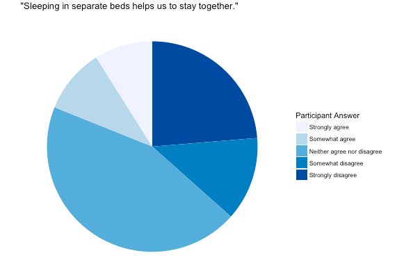

# Introduction

During presentations of final projects for one of my informatics classes, many people were surprised to see that all of the data visualizations on the project were done using `ggplot2`. My team heard a lot of compliments about how our graphs and charts were pleasing to the eye without needing the use of other packages like  `plotly` or `leaflet`. If you would like to see the project that was recipient of these compliments, check it out [here](https://jessicaxlou.shinyapps.io/Sleeping-Alone/).

In this blog post, I will be talking about the two features of `ggplot2` that made our visualizations stand out: themes and colors.

#Themes

Using themes helped my group modify pieces of information that would have been automatically added to our graphs and charts. Using `+ theme(...)` will allow you to customize what is shown on your visualizations one element at a time. There are also premade themes that are quick and easy to use on your visualizations as well. For my team's final project, we mostly used this feature to remove specific elements, like axis labels, background colors, etc. For example: 

```
plot + theme(plot.title = element_blank(),
             axis.title.x = element_blank(),
             axis.title.y = element_blank())
```

The code above uses `element_blank()` to remove the title of the plor, the title of the x axis, and the title of the y axis, respectively. Other elements that my team has modified include:

- `legend.title`: the title of the legend
- `panel.grid`: the grid lines in the background of the plot
- `panel.background`: the background of the plot
- `axis.title`: the titles of both the x and y axis

As for premade themes, my team utilized them for quick and easy themes for our charts. For example we used `+ theme_void` and `+ theme_minimal` to make our charts look much more simple and remove elements that we felt were unnecessary to the visualizations. Many premade themes are out there for your convenience, you just have to find them!

#Colors

Colors add a whole new level to data visualizations, and can be used not only to be aesthetically pleasing but to also further enforce the information you are displaying. Colors can be manually defined using codes and color names, and palette may also be used to have the colors in your visualizations decided automatically for you.

This code below is an example of how specific colors may be manually chosen. The codes like `"#FF8C94"` below are RGB codes. These RGB codes are useful when you have specific colors and shades in mind.

```
plot + scale_fill_manual(values=c("#FF8C94", "#FFAAA6", "#FFD3B5", "#DCEDC2", "#A8E6CE", "#C4FAF8", "#ACE7FF"))
```

There are also predefined color names that may be used as well. For example:

```
plot + scale_fill_manual(values=c("salmon", "blue", "gray", "gray90", "black", "tan", "lightpink"))
```

On top of choosing colors manually, you may also prefer to utilize palettes, which are convenient sets of colors that have been pre-chosen. For instance, I used `+ scale_fill_brewer(palette="Blues")` on one of my pie charts to add a spectrum of different shades of blue for the pie slice colors, which can be seen here:



Many palettes are available to use, with varieties of different colors and spectrums.

#Thank you for reading!

Thank you for reading this blog post, I hope that it is helpful in at least introducing a couple of different ways that `ggplot2` visualizations can be brought to the next level. Happy coding!